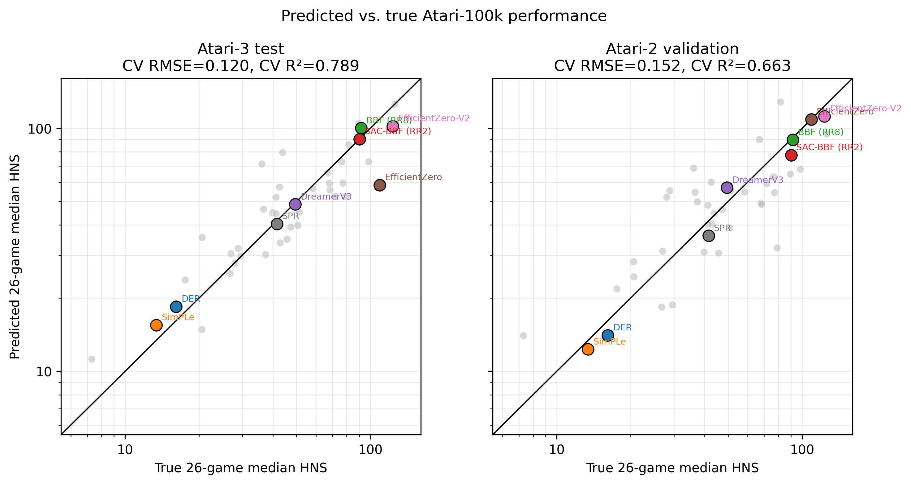
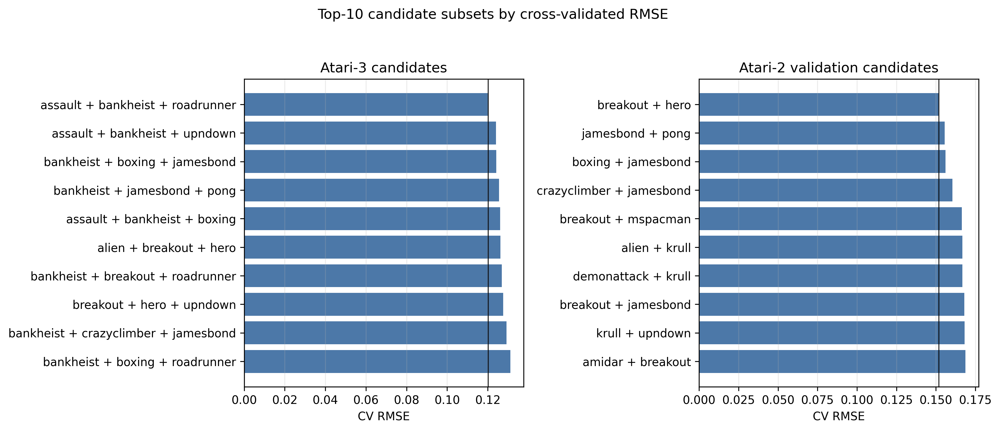
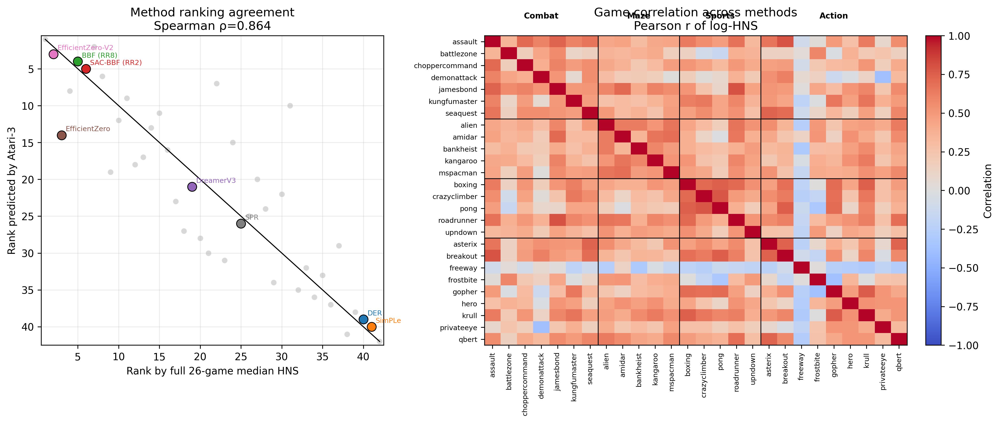

# Data-Efficient Atari-3

This repository contains the data and script used to select a compact
Atari-100k benchmark subset with the Atari-5 methodology.

The selected split is:

- Test games: `assault`, `bankheist`, `roadrunner`
- Validation games: `breakout`, `hero`

## Method

The script follows the core Atari-5 procedure:

1. Convert raw Atari scores to human-normalized scores.
2. Apply `log10(1 + max(HNS, 0))`.
3. Predict each method's full 26-game median HNS using linear regression
   without an intercept.
4. Rank game subsets by 10-fold cross-validated error.

The split is selected sequentially. First, the three Atari-3 test games are
chosen from all 26 Atari-100k games. After this test set is fixed, those three
games are removed from the search space and the two validation games are chosen
from the remaining 23 games. Thus, the validation set is disjoint from the
Atari-3 test set and is selected after the primary test set.

## Metrics to report

The main metric is cross-validated RMSE in the transformed Atari-5 target space:
`log10(1 + max(median HNS across all 26 games, 0))`.

For comparison with the Atari-5 paper, report:

- CV RMSE: primary optimization metric.
- CV R²: fraction of target variance explained.
- Approximate relative error: `CV MAE * ln(10) * 100`.
- Coefficients: the linear weights for the selected games.
- Number of methods: 42 in this dataset.

For the selected split:

| Subset | Games | CV RMSE | CV R² | Approx. relative error |
|---|---|---:|---:|---:|
| Atari-3 test | `assault`, `bankheist`, `roadrunner` | 0.1202 | 0.7889 | 21.05% |
| Atari-2 validation | `breakout`, `hero` | 0.1519 | 0.6630 | 28.57% |

## Repository layout

```text
.
├── atari3.py
├── data/
│   ├── Atari100k-Results.csv
│   ├── Atari100k-Metadata.csv
│   └── Atari-Human.csv
└── analysis/
    ├── selection.json
    ├── Atari3-candidates.csv
    ├── Atari2-Validation-candidates.csv
    └── Atari100k-Normalized.csv
```

## Run

Install the dependencies:

```bash
python3 -m pip install -r requirements.txt
```

Recompute the selection:

```bash
python3 atari3.py
```

To cross-validate every possible three-game candidate instead of only the
Atari-5-style prefiltered candidates:

```bash
python3 atari3.py --top-k 2600
```

The output files are written to `analysis/`.

## Figures

### Predicted vs. true performance



### Top candidate subsets



### Rank agreement and game correlations

